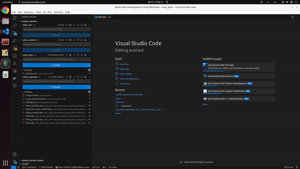
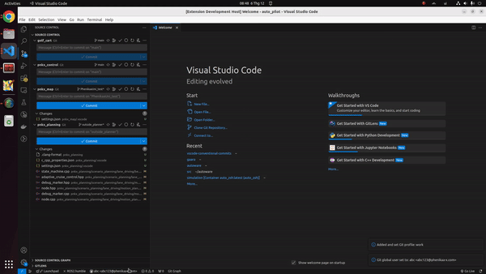

# gaara README

This extension add new user and save in setting.json, choose exist user and set global user name git, call convention commint.

## Features

- Add new user, save in setting.json
- Choose exist user name and set global user name git
- Call convention commit

## Requiment

- Install extension convention before use this extension.

## Usage

**Enjoy!**
